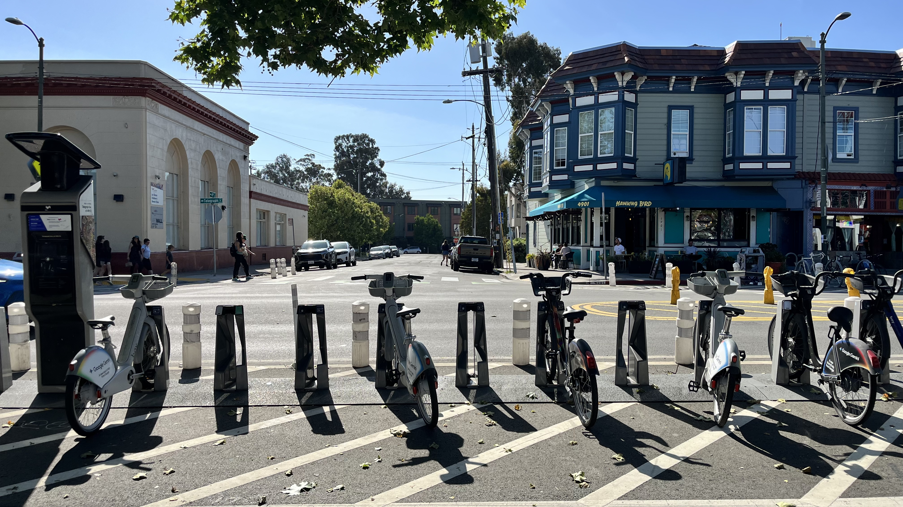

<link rel="stylesheet" href="{{ '/assets/css/style.css' | relative_url }}">
<link rel="stylesheet" href="https://unpkg.com/leaflet/dist/leaflet.css" />

  <h1 class="hero-title">Last Mile for the Last Mile</h1>
  
Effects of the Built Environment and Implications for Equity

  
<strong>Group 7</strong> · Urban Informatics Final Project

<!-- ─────────────────────────────────────────
     INTRODUCTION
───────────────────────────────────────── -->
<h1 style="padding-top: 40px;">Introduction</h1>

Bikesharing technologies in cities present planners with a rapidly evolving real-life experiment on how people chose to move through a city, the nature of their trips, and the kinds of streetscapes and destinations they are attracted to (Fishman, 2019). And since their inception in early 2010s, station-based bike sharing ridership in North America has grown from 3.7 million to 81 million in 2023, with 90% of all ridership being generated by ten cities. Among the highest-ridership bikeshare fleets is BayWheels (San Francisco Bay Area), with around three million riders across networks in San Francisco, San Jose, Emeryville, Oakland, and Berkeley. Operating under a public-private partnership between the Metropolitan Transportation Commission (MTC) and Lyft, MTC contributes capital investments for bicycle infrastructure and permits for the use of public space while Lyft manages daily maintenance, labor, outreach, and technology. In addition to capital investments, Lyft’s share of the costs are covered by BayWheels rider revenue, developer partnerships, and advertisements (i.e. Google Gemini has been the recent dominant advert on the face of bikes and facilities). A study of BayWheel’s impact in the East Bay is motivated by a recent contract negotiation between the agency and private provider, where the measured success of ridership patterns is essential for future funding strategies.

 
This distinction between private operation and public subsidy is important as it reveals bike sharing technology as a contemporary phenomenon of the long-standing debate in transportation planning on the nature of providing the means to move through space – regardless of race, gender or class – as an outright public good. Framed as a ‘first and last mile’ solution for closing transportation gaps, a growing body of research complicates the premise and promise of market-based micromobility interventions helping facilitate transportation services where government agencies cannot (McNeil et al., 2017; Zhang, 2022; Brown & Howell, 2024). BayWheels is not the first transportation technology and infrastructure investment to controversially shift the East Bay mobility landscape along race, gender and class lines. Mid-century suburbanization favored regional transportation investments in freeways and commuter rail service (BART), to connect affluent, white office-workers to employment in urban cores; however, these uneven infrastructural investments lead to decline in racially diverse neighborhoods as funding was diverted away from intercity bus service and the construction of freeways and BART lead to the clearance of entire neighborhoods (Golub et al., 2013). In the context of the East Bay’s layered transportation history, which still echoes into the present landscape, our study seeks to understand how these imbalances are unfolding across urban neighborhoods in the midst of a new technological shift in mobility. Using Stehlin’s conceptual framework of “already splintered urbanism” (2022), we use a combination of raw Lyft trip data from 2020, built environment and demographic variables, and neighborhood resource opportunity scores to analyze the extent to which: (1) bike share ridership is influenced by adjacent attractive land uses and proximity of quality infrastructure; and (2) the distribution of bike-share ridership is correlated with neighborhood opportunity and quality of public goods. Our hypothesis is that neighborhoods previously disinvested from through formal and informal discrimination in the context of transportation infrastructure are the same neighborhoods experiencing the imbalance of access and benefits of emerging BayWheels bike sharing services. 

<!-- ─────────────────────────────────────────
     DATA AND METHODS SECTION
───────────────────────────────────────── -->
<h1>Data and Methods</h1>
<ol>
  <!-- ─────────────────────────────────────────
       1. Sources
  ───────────────────────────────────────── -->
  <li>
    <h3>Sources</h3>

    

      For our research project, we compiled a dyadic dataset between Berkeley and Oakland,
      California to encompass municipal level interactions with Lyft's Baywheels bikeshare service.
    

    
The following datasets were used in our analysis:

    <ul>
      <li>
        <strong>Alameda County Open Data Hub</strong> –
        Geographic boundaries for geospatial analysis.
      </li>
      <li>
        <strong>California Tax Credit Allocation Committee Opportunity Map and Neighborhood Change Data</strong> –
        Identifies neighborhood characteristics that impact lived experience at the census tract level.
      </li>
      <li>
        <strong>Lyft Baywheels System Data</strong> –
        Raw ridership tabular data at the station level from 2020 to 2025.
      </li>
      <li>
        <strong>United States Census Bureau TIGER/Line</strong> –
        Geographic boundaries for geospatial analysis.
      </li>
      <li>
        <strong>2022 American Community Survey (ACS)</strong> –
        Population and employment absolute totals within a ½ mile euclidean buffer of station points.
      </li>
      <li>
        <strong>LEHD Origin-Destination Employment Statistics (LODES)</strong> –
        Metric for the intensity of land use within a ½ mile euclidean buffer of station points.
      </li>
    </ul>
  </li>

  <!-- ─────────────────────────────────────────
       2. Methodology
  ───────────────────────────────────────── -->
  <li>
    <h3>Methodology</h3>

    

      The analysis proceeds in three parts, building to our overarching hypothesis on the unequal
      distribution of bike share service in the East Bay: where trips happen, how trips function in
      relation to station location, and who is able to access bike share. First, general mobility
      patterns across six years of tabular ridership data to understand system trends, and the
      possible shocks to the system from policy and infrastructure interventions. Second, using the
      established mobility patterns, a station typology cluster is calculated to help contextualize
      the patterns in terms of adjacent land use and employment. Third, station-level ridership data
      was compared across neighborhoods graded based on their economic and social opportunities
      and resources.
    

    <ul>

      <!-- 2a. BayWheels Mobility Patterns -->
      <li>
        <h4>BayWheels Mobility Patterns</h4>
        <ul>
          <li>
            

              Producing an assessment of mobility patterns required cleaning the raw BayWheels
              ridership dataset from 2020 to 2025. The six individual annual data panels were derived
              from a script we utilized to merge the monthly ridership reports. Our analysis begins
              in May 2020 as a 'post-pandemic' temporal framework. Firstly, Lyft was still
              transitioning from Ford's ridership data standards, which only had station ID as the
              location identifier and this is incongruent with post May 2020 data. Second, rides
              before May were insignificant for meaningful interpretation against other months and
              years due to low volume amidst the shutdown of streets and land use attractions.
              The newly merged dataframe consisted of 1.1 million rides.
            

          </li>
          <li>
            

              Controlling for geographic scope, a script was produced to first filter for each ride's
              origin and ending city using the Station ID, and then another filter for Berkeley and
              Oakland cities only. After filtering out Emeryville, San Jose, and San Francisco trips,
              the resulting Berkeley and Oakland specific dataframe encompassed 988,767 rides.
            

          </li>
          <li>
            

              For tidying and readability, an additional 8,048 rides without trip start or end station
              name or ID was dropped from the dataset as an insignificant portion of trips. Additionally,
              2,532 trips from early 2021 were dropped due to all start and end station name and ID
              values missing because of a data recordation error on behalf of Lyft. A total of fifteen
              stations changed either station name or ID during the time span, and we produced a script
              to aggregate ridership data for unique stations with the most frequent station name used.
              For instance, 'West Oakland BART' and 'West Oakland Bart station' combined ridership
              totals under 'West Oakland BART', with downstream grouped analysis merging and matching
              on station name as opposed to ID. Year, month, day, and trip duration were extracted from
              the trip start and trip end columns for downstream analysis. Separate date and time columns
              were also utilized to determine the year a station opened from 2021 to 2025, using the
              first recorded trip starting or ending at the station as a proxy in lieu of official
              timelines. All column names, data features, and data types were altered when appropriate
              for readability and analysis purposes.
            

          </li>
          <li>
            

              As a final filtering of anomalous data, the trip duration category was used to find the
              5% and 95% quantile to determine the distribution of trip duration extremes. The outlier
              values were 2.5 minutes on the low end, and 36 minutes on the high end. After verifying
              against precedent analyses and studies, a manual range of rides either below two minutes
              or above 3 hours were dropped from the dataset. An additional 28,055 rides were dropped
              and, as discussed in the limitations section, the rides on the lower end of the quantile
              might have represented 'attempted rides' where the equipment either malfunctioned or a
              user ran out of funds. Rides on the high end of the quantile were assumed to either have
              been data entry errors, equipment malfunctions, or stolen bikes.
            

          </li>
          <li>
            

              Using the available station-level data features, a variety of data exploration metrics
              were computed to understand the trends happening across the system. For most comparisons
              across stations, or visualizing a trend, it was important to use median instead of mean
              given the highly skewed distribution of both station characteristics and trip characteristics.
            

            <ul>
              <li>
                <strong>Ridership Volume per Station (2020–2025):</strong>
                Dataframe cataloguing ridership totals per year per station, allowing us to easily find
                trends in bike share trips over time. Additionally, the metrics of median ride and growth
                percentage (using 2021 as the baseline) were calculated as further comparison values across
                different stations. Eventual ridership line graph per city over the time frame is visualized
                using this ridership dataframe. Case study metrics were sourced from this dataframe.
              </li>
              <li>
                <strong>Origin-Destination Pairs (2020–2025):</strong>
                Dataframe cataloguing ridership totals per uni-directional origin-destination pair to
                understand which stations tended to travel between the most. Case study metrics were
                sourced from this dataframe.
              </li>
              <li>
                <strong>Median Trip Duration (all bikes):</strong>
                In addition to showing the 25th, 75th, and IQR values, this metric shows how users'
                interaction with BayWheels with concern to time changed since the pandemic.
              </li>
              <li>
                <strong>Median Trip Duration (classic bikes):</strong>
                Uses the same statistical logic for all bikes, but this metric helps us understand the
                effect of e-bikes on BayWheels travel times across the system. Filtering for classic
                bikes alone allows us to understand the true travel behavior of users based on time
                spent riding.
              </li>
              <li>
                <strong>Membership Share (2020–2025):</strong>
                A summary table of casual and membership users across the system. The growth patterns
                are used to assess the effectiveness of pricing policy as an intervention for inducing
                ridership.
              </li>
              <li>
                <strong>BART Trips (2020–2025):</strong>
                Based on trips which have a start or an end at a BART station, and aggregated year by
                year per station. The metric allows us to understand the distribution of bike share
                resources based on a station's 'first and last mile' metric. Additionally, the BART
                and Non-BART trip reference metrics are sourced from this analysis.
              </li>
            </ul>
          </li>
        </ul>
      </li>

      <!-- 2b. Station Typology -->
      <li>
        <h4>Station Typology</h4>
        <ul>
          <li>
            

              In order to make our observations of ridership patterns more meaningful, we first develop
              a bikeshare station typology to group stations with similar built environment characteristics
              together. This typology is based on Steven R. Gehrke and Timothy F. Welch's "A bikeshare
              station area typology to forecast the station-level ridership of system expansion" (2019),
              in which they use five built environment variables to classify existing bikeshare station
              areas in Washington D.C. Of the five variables, we used three in our analysis:
            

            <ul>
              <li><strong>Activity:</strong> Number of persons and jobs</li>
              <li><strong>Employment-population balance:</strong> Ratio of jobs to persons</li>
              <li><strong>Distance (miles) to nearest rail station</strong></li>
            </ul>
          </li>
          <li>
            

              The two variables from the paper that were not included in our analysis are beta index
              (the ratio of street links to intersection nodes) and distance to nearest park. Across
              the existing literature, the first three variables are much more often cited for their
              influence on ridership compared to the latter two. For this reason, given time constraints
              and difficulty acquiring the necessary data, these variables were excluded in our analysis.
            

          </li>
          <li>
            
Two other key differences in our approach:

            <ul>
              <li>
                Instead of forming a grid and classifying each area of the grid, we classify each station
                directly since we are not attempting to predict ridership of a future station based on
                its location.
              </li>
              <li>
                The paper uses Latent Class Cluster Analysis (LCCA). In Python, the closest equivalent
                is Gaussian Mixture Model (GMM), via sklearn, which is model-based and probabilistic
                like LCCA.
              </li>
            </ul>
          </li>
          <li>
            
Clustering approach:

            <ul>
              <li>
                The optimal number of clusters was selected by fitting GMMs for k=2 through k=8 and
                choosing the solution with the lowest Bayesian Information Criterion (BIC), a model
                selection metric that balances goodness of fit against model complexity, where lower
                values indicate a better balance. The BIC declined sharply from k=3 (944.7) to k=4
                (832.8) before rising again, indicating that four clusters best represented the
                underlying structure of the data.
              </li>
            </ul>
          </li>
          <li>
            

              Given our clusters, we then performed exploratory analysis of each station cluster against
              several other factors that have been shown to influence station ridership. Based on the
              work of Faghih-Imani et al. (2014) on Bixi ridership in Montreal, we explored the effects
              of several bicycle infrastructure variables on ridership:
            

            <ul>
              <li><strong>Length of major roads in 400m buffer:</strong> expected negative effect</li>
              <li><strong>Length of minor roads in 400m buffer:</strong> expected positive effect</li>
              <li><strong>Number of Baywheels stations in 800m buffer:</strong> expected positive effect</li>
              <li><strong>Length of bicycle facility in 800m buffer:</strong> expected positive effect</li>
            </ul>
          </li>
        </ul>
      </li>

      <!-- 2c. Opportunity Score and Ridership Effects -->
      <li>
        <h4>Opportunity Score and Ridership Effects</h4>
        <ul>
          <li>
            

              To understand how resource disparities affected bikeshare ridership in Berkeley and Oakland,
              we first had to bound opportunity score data from the California Tax Credit Allocation
              Committee to these two geographies. This was accomplished through a dissolve technique in
              Python to spatially join parquet files into a unified boundary layer downloaded from the
              Alameda County Open Data Portal and United States Census Bureau. The California Tax Credit
              Allocation Committee (TCAC) data was then bound to the Berkeley/Oakland dissolved layer to
              display opportunity scores, opportunity categories, and racial demographics at a census
              tract level between the two cities.
            

          </li>
          <li>
            

              Next, Lyft Baywheels data over a six year period (2020–2025) was cleaned and organized for
              geospatial accuracy and data relevance to display ridership trends by census tract opportunity
              score. Station locations were used to convert station ridership data into a geodataframe.
              Because this analysis required total ridership by station counts by study year, station
              locations had to be averaged to get consistent station locations across the study period.
              Because of the variety of XY coordinates for a single station, an averaging calculation was
              used in the code to apply the average coordinate across a single station for all six years
              for locational accuracy. To have a consistent ridership metric, only station origin trips
              were used in the visualization of data to understand where people were starting their trips
              and in which census tract opportunity score they originated from.
            

          </li>
          <li>
            

              Finally, Lyft Baywheels data was spatially joined to the dissolved Berkeley/Oakland layer
              to visualize data on a folium-based Python map and for interactive line and dot charts to
              understand the connection between opportunity scores and bikeshare ridership.
            

            <ul>
              <li>
                <strong>% of People of Color:</strong>
                Each census tract has a % POC pop-up. This percentage is a simple addition equation of
                all non-white population percentages in a census tract. This is used to understand how
                formal and informal racially discriminatory policies have shaped the two geographies and
                aid in the understanding of race-based mobility access.
              </li>
              <li>
                <strong>Opportunity Score:</strong>
                TCAC opportunity scores are calculated based on eight key indicators — above 200% of
                poverty level, adult education (bachelor's degree), employment, median home value, math
                and reading proficiency, high school graduation rates, and student poverty rates. A point
                is assigned to the opportunity score for every indicator that falls above the regional
                median.
              </li>
              <li>
                <strong>Opportunity Category:</strong>
                TCAC opportunity categories identify neighborhoods whose characteristics are strongly
                associated with positive economic, educational, and health outcomes. Census tracts are
                ranked based on 21 indicators divided into categories: Highest Resource, High Resource,
                Moderate Resource, and Low Resource in a 20% bin threshold.
              </li>
            </ul>
          </li>
        </ul>
      </li>

    </ul>
  </li>
</ol>

<!-- ─────────────────────────────────────────
     GREATER RIDERSHIP TRENDS SECTION
───────────────────────────────────────── -->
<h1>Greater Ridership Trends</h1>

<label style="padding-top: 20px" for="yearSlider">Year</label>

  <input type="range" id="yearSlider" min="2020" max="2025" step="1" value="2025">
  

    2020
    2021
    2022
    2023
    2024
    2025
  

<iframe src="/assets/charts/ridership-trends.html" width="100%" height="500px" frameborder="0"></iframe>
<h4>Ridership Trends and City Contexts</h4>

Total ridership volumes per BayWheels station were aggregated into groups by city, and then further grouped by the total rides per month during a given year. Seeing the results visually displayed helps us situate BayWheels trends in the East Bay: seasonal variations with lower ridership in winter versus summer & fall, a summer trough period in Berkeley as students depart the city, and an exponential increase of total ridership across all stations for both cities in the summer and fall of 2024. Of the top 30 origin-destination pairs for total ridership across the study period: 24 pairs included a BART station at either the start or end of a trip, 2 pairs were pandemic-era ‘leisure’ loop trips (El Embarcadero, and Addison Street & 4th Street) that have since seen dramatic decline though the total ridership volume for each station alone has increased over time, and 4 pairs that were associated with the University of California, Berkeley.

A few shocks to the system can help contextualize the ridership trends: 

<ul>
  <li>September 2023: BART headways are reduced on weekdays from 20 minutes to 10 minutes.</li>
  <li>November 2023: Membership cost reduction from $169 to $150, and Membership E-Bike cost from 20 cents a minute to 15 cents. This is in addition to the existing Bike Share for All program for low-income residents.</li>
  <li>April 2024: MTC funded E-Bike fleet launches in the East Bay.</li>
  <li>January to December 2025: Oakland installs 15 expansion stations in MTC EPC neighborhoods.</li>
</ul>

For the impacts of pricing, the trends found in the Rider Type Share table are aligned with previous findings in the literature analyzing the relationship between travel behavior and price preference (Kaviti et al., 2019). In 2024, for both BART and Non-BART trips, BayWheels trips made by users with a membership grew by 68% and 79% respectively. Following 2022, the membership and casual ridership share gap for all trips has increased from a 14% difference to a 52% difference in favor of the share by users with a membership. However, though the membership trends suggest an impact of pricing policy, and are reflective of similar ridership trends in other major American cities, our analysis acknowledges that there are a bundle of factors influencing ridership. The next charts explore to what extent the E-Bike fleet launch in 2024 impacted bike share ridership.

<h4>Electric Bike Impacts</h4>

Median trip duration per year across all trips and stations signals how the BayWheels system moved from technological novelty in 2020 (13.8 minutes) towards an increasingly key part of the regional and city transportation network in 2025 (8.2 minutes). The plateau for classic bike trips only beginning in 2023 is indicative of an emerging transportation technology finally “nudging” (Riggs, 2022) potential users into utilizing a bike share service as a connection for first-and-last mile trips. In alignment with our hypothesis, these results suggest how BayWheels fits the standard bike share model of providing quick trips for users who are already within a preexisting density of other amenity-destinations and transportation.

As for our approach with infrastructure and built environment effects, we isolate classic bike trips only to show the influence of E-Bikes on travel behavior since its introduction to stations in 2024 (7.7 minutes and 6.4 minutes). In comparison with the classic bikes only trend, we can interpret the difference as commuters continuing to take the same kinds of trips from similar origin-destination pairs, but can now do so at a faster pace. It is also the case that E-Bikes likely created new forms of mobility for those who previously could not ascend streets with steep grades. The suggested impacts on ridership are strengthened by the share of trips by classic and electric bikes in 2024 and 2025, as visualized in the waffle chart. Electric bike trips gained 20% of the share compared to classic trips which lost 20% of the share. Considering the 15 new expansion stations weren’t installed until 2025, the introduction of E-Bikes into the Berkeley and Oakland BayWheels station fleet makes a considerable case for the influence on the rise of ridership since 2023. As explored in the graph below with neighborhood disparities, and in a station typology, the appearance and quality of the streetscape does play an important role in the generation of ridership.

<!-- ─────────────────────────────────────────
     BUILT ENVIRONMENT EFFECTS SECTION
───────────────────────────────────────── -->
<h1>Built Environment Effects: Observations Across Station Types </h1>
<h4>Baywheels Station Typology</h4>

<table style="border-collapse: collapse; width: 100%; font-size: 13px; table-layout: fixed; margin-top: 20px">
  <thead>
    <tr style="background: #f5f5f5;">
      <th style="padding: 10px; border: 1px solid #ddd; text-align: left; width: 8%;">Cluster</th>
      <th style="padding: 10px; border: 1px solid #ddd; text-align: left; width: 18%;">Type</th>
      <th style="padding: 10px; border: 1px solid #ddd; text-align: right; width: 8%;">Stations</th>
      <th style="padding: 10px; border: 1px solid #ddd; text-align: right; width: 12%;">Avg. Activity</th>
      <th style="padding: 10px; border: 1px solid #ddd; text-align: right; width: 14%;">Jobs/ Residents</th>
      <th style="padding: 10px; border: 1px solid #ddd; text-align: right; width: 12%;">Dist. to BART</th>
      <th style="padding: 10px; border: 1px solid #ddd; text-align: left; width: 28%;">Description</th>
    </tr>
  </thead>
  <tbody>
   <tr style="background: #fafafa;">
      <td style="padding: 10px; border: 1px solid #ddd;">0</td>
      <td style="padding: 10px; border: 1px solid #ddd;">Transit-Oriented Commercial Core</td>
      <td style="padding: 10px; border: 1px solid #ddd; text-align: right;">13</td>
      <td style="padding: 10px; border: 1px solid #ddd; text-align: right;">67,428</td>
      <td style="padding: 10px; border: 1px solid #ddd; text-align: right;">4.21</td>
      <td style="padding: 10px; border: 1px solid #ddd; text-align: right;">0.16 mi</td>
      <td style="padding: 10px; border: 1px solid #ddd;">Highest activity and employment concentration, anchored near BART. Well-suited for commute and intermodal trips.</td>
    </tr>
    <tr>
      <td style="padding: 10px; border: 1px solid #ddd;">1</td>
      <td style="padding: 10px; border: 1px solid #ddd;">High-Density Mixed Urban</td>
      <td style="padding: 10px; border: 1px solid #ddd; text-align: right;">32</td>
      <td style="padding: 10px; border: 1px solid #ddd; text-align: right;">32,649</td>
      <td style="padding: 10px; border: 1px solid #ddd; text-align: right;">1.38</td>
      <td style="padding: 10px; border: 1px solid #ddd; text-align: right;">0.39 mi</td>
      <td style="padding: 10px; border: 1px solid #ddd;">Dense, walkable neighborhoods blending residential and commercial uses with good transit proximity.</td>
    </tr>
    <tr style="background: #fafafa;">
      <td style="padding: 10px; border: 1px solid #ddd;">2</td>
      <td style="padding: 10px; border: 1px solid #ddd;">Residential – Transit Access</td>
      <td style="padding: 10px; border: 1px solid #ddd; text-align: right;">86</td>
      <td style="padding: 10px; border: 1px solid #ddd; text-align: right;">16,300</td>
      <td style="padding: 10px; border: 1px solid #ddd; text-align: right;">0.34</td>
      <td style="padding: 10px; border: 1px solid #ddd; text-align: right;">0.60 mi</td>
      <td style="padding: 10px; border: 1px solid #ddd;">The largest cluster. Predominantly residential neighborhoods within reasonable BART distance, likely generating first- and last-mile commute trips.</td>
    </tr>
    <tr>
      <td style="padding: 10px; border: 1px solid #ddd;">3</td>
      <td style="padding: 10px; border: 1px solid #ddd;">Residential – Low Transit Access</td>
      <td style="padding: 10px; border: 1px solid #ddd; text-align: right;">23</td>
      <td style="padding: 10px; border: 1px solid #ddd; text-align: right;">13,546</td>
      <td style="padding: 10px; border: 1px solid #ddd; text-align: right;">1.47</td>
      <td style="padding: 10px; border: 1px solid #ddd; text-align: right;">1.24 mi</td>
      <td style="padding: 10px; border: 1px solid #ddd;">Lower-density residential areas furthest from BART, likely serving recreational and local trips.</td>
    </tr>
  </tbody>
</table>

  <h4 style="margin-bottom: 8px;">Variable Definitions</h4>
  
<strong>Activity</strong> — The total number of residents and jobs within a half-mile buffer of each station, drawn from the 2022 American Community Survey (ACS) and LEHD Origin-Destination Employment Statistics (LODES). This measure captures the overall intensity of land use surrounding a station and is a strong predictor of bikeshare demand (Faghih-Imani et al., 2014; Rixey, 2013).

  
<strong>Employment-Population Balance</strong> — The ratio of jobs to residents within the station area buffer. Values greater than 1 indicate employment-dominated contexts; values less than 1 indicate residential dominance. This measure distinguishes commercial and mixed-use station areas from purely residential ones (Gehrke & Welch, 2019).

  
<strong>Distance to Nearest Rail Station</strong> — The straight-line distance in miles from each bikeshare station to the nearest BART station. Proximity to rail has been consistently associated with higher bikeshare ridership, reflecting the role of bikeshare as a first- and last-mile solution to fixed-route transit (Shaheen et al., 2010; El-Assi et al., 2017).

  Classifying similar stations together allows us to do two things:
  <ol>
    <li>Visualize and compare ridership across station types, seeing which built environment variables have the greatest impact on ridership.</li>
    <li>Introduce other variables to see their effects on ridership within one station type, to see the effects of that variable on ridership holding the other variables somewhat more constant/similar.</li>
  </ol>

We can use the visualization below to observe the individual effects of the different built environment characteristics we used to classify station types. The strongest observed correlation appears to be between ridership and distance from the nearest BART station, which is backed by existing research (Guo et. al. 2022, Faghih-Imani et. al. 2014).

  <label>X Axis: 
    <select id="xSelect">
      <option>Distance to BART (mi)</option>
      <option>Employment-Population Balance</option>
      <option>Activity</option>
    </select>
  </label>
  &nbsp;
  <label>Y Axis:
    <select id="ySelect">
      <option>Combined Ridership</option>
      <option>Origin Ridership</option>
      <option>Destination Ridership</option>
    </select>
  </label>

<h4>Policy Implications</h4>

  Creating a station typology for bikeshare in the Bay Area has significant policy implications for regional transportation planning. It will allow transportation planners to understand underlying factors that make an effective station, and enable them to make informed decisions on not only station placement, but also road and street improvements to improve the bikeshare rider’s experience, as well as prioritization of pedestrian and bicycle facility development. Moreover, solutions can be tailored to station type, with the understanding that not all solutions apply to all station types.

  <label for="barYearSlider">Year</label>
  

    <input type="range" id="barYearSlider" min="2020" max="2025" step="1" value="2025" style="width: 100%;">
    

      2020
      2021
      2022
      2023
      2024
      2025
    

  

<h4>Outliers and Points of Interest</h4>

By grouping ridership by station type, we can see that stations that fall under “Residential - Low Transit Access” consistently have lower ridership across the years, which is expected given this station type’s inaccessibility to BART. Moreover, we can see several consistent high-performing outliers with the stations on UC Berkeley’s campus, and several BART stations, such as MacArthur and Downtown Berkeley stations. Downtown Berkeley, besides being located by the university, and MacArthur are located in neighborhoods with a high concentration of restaurants. Although we were unable to capture it in our analysis, previous literature confirms that universities, and a high concentration of restaurants are points of interest that have a significant positive effect on ridership (Guo et. al. 2022, Faghih-Imani et. al. 2014).

<h4>Weak Effect of Bicycle Facilities</h4>

We performed analysis for an array for bicycle facility variables including:
<ul>
<li>Length of major roads in 400m buffer: expected negative effect</li>
<li>Length of minor roads in 400m buffer: expected positive effect</li>
<li>Number of Baywheels stations in 800m buffer: expected positive effect</li>
<li>Length of bicycle facility in 800m buffer: expected positive effect</li>
</ul>

We found that for Baywheels stations in the East Bay, there was no significant correlation between length of major roads or length of minor roads and ridership volume. In Montreal, Fgahih-Imani, et. al. found that length of major roads had a negative effect on ridership while length of minor roads had a positive effect. We also found that the number of Baywheels stations in proximity had no correlation with ridership, which is surprising since station density was shown to have a significant positive effect on ridership. We found a moderate correlation (r=0.40) between length of bicycle lanes near a station and ridership volume for stations in the “Residential area – low transit access” cluster, but otherwise weak or no correlation for other station types. The limitation of this analysis is that it was constrained to 2025 data only, and newer stations may have lower ridership numbers.

<!-- ─────────────────────────────────────────
     RESOURCE DISPARITY EFFECTS SECTION
───────────────────────────────────────── -->
<h4>BART Neighborhood Disparities</h4>

Statistical testing with control variables is required to further understand the dynamics of what attracts and generates trips in the East Bay context, explored in more detail in the Station Typology section. Returning to our initial hypothesis, an imbalance between bike share stations located in amenity-rich neighborhoods and neighborhoods with a low supply of public goods can be explored through patterns present in the raw ridership folder. MacAruther BART, with 61,163 total first or last mile trips (ride starts or ends) is located adjacent to the Temescal, Mosswood and Shafter neighborhoods, rapidly gentrifying areas with high-income renters that Motivate/Lyft initially planned station sites around. Whereas, with Fruitvale BART at 3,642 first or last mile trips, Motivate initially didn’t place a station east of High Street in East Oakland, even though the area is arguably denser and has more transit dependent residents than the North Oakland neighborhoods. The pattern of bike share development in the East Bay, and its associated ridership, is reflective of the layered transportation discrimination history (Golub et al., 2013; Stehlin & Payne, 2022) emerging into the present.

To demonstrate our two research paths converging, below is a visual comparison of a streetscape at MacArthur’s highest origin-destination pair, 49th Street and Telegraph Avenue, and Fruitvale’s highest origin-destination pair, Foothill Boulevard and Fruitvale Avenue. In addition to the density of attractive amenities, and proximity to generators in other neighborhoods, Telegraph Avenue (from 15th Street and Broadway to 51st Street) received complete streets bicycle and pedestrian interventions, installed by OakDOT from 2019 to 2022. While the data is influenced by shocks from pricing adjustments and the E-Bike fleet, there is a noticeable growth in ridership along Telegraph Avenue bike share stations: 49th Street (166%), Shattuck Avenue (208%) & 55th Street (91%). Installing improved bicycle facilities and traffic calming countermeasures is not likely to induce significant ridership, but the visual differences in streetscape quality helps us start a dialogue on what might explain the differences between the observed travel patterns of two Oakland neighborhood bike share stations.

<h1>Neighborhood Resource Disparity Effects on Bikeshare Ridership</h1>

Mobility access is heavily influenced by personal characteristics such as race and income (Dill et al. 2022). Historical exclusionary policies, such as redlining and urban renewal, have dramatically impacted who can – and cannot – access transportation across public and private modes of transportation (Dill et al. 2022). For these reasons, we use race and income – in conjunction with TCAC derived opportunity score – to understand how Lyft’s Baywheels ridership is affected across geographies. While our analysis is not robust enough to determine correlation and causality between Baywheels stations siting, ridership, and inequitable mobility distribution, unequal mobility patterns persist in bikeshare adoption in lower-resource areas compared to moderate-, high-, and highest-resource census tracts across both Berkeley and Oakland. 
<h4>Lyft Bike Ridership By TCAC Opportunity Score</h4>

<iframe src="/assets/charts/tcac_lyft_map.html" width="100%" height="500px" frameborder="0"></iframe>

A majority of Berkeley and Oakland’s highest-resource neighborhoods are located in the hills and outside of close proximity to the Baywheels network. Lyft’s Baywheels bikeshare network almost exclusively serves the flatlands in both Berkeley and Oakland where lower-resource census tracts are typically located. However, as seen in <i>Lyft Bike Ridership By TCAC Opportunity Score</i>, Baywheels tend to have a clustering effect for trip origin at attractive magnet amenities such as BART Stations and the University of California, Berkeley.

While there is a visible ridership difference between low- and high-resource areas, a seemingly bigger determinant of ridership origin when using the Baywheels service is the presence of these points-of-interest rather than resource score. Through our analysis we cannot conclusively say that opportunity score impacts ridership, but what we can say is that the lack of points-of-interests that drive Baywheels ridership are not present in low-resource tracts to drive ridership in comparison to higher-resource areas.

<iframe src="/assets/charts/ridership_vs_opportunity.html" width="100%" height="500px" frameborder="0"></iframe>

To illustrate the slight impact of opportunity score on ridership, <i>Trend: Ridership vs. Opportunity Score</i> illustrates a scatterplot regression analysis of Baywheels ridership. There is a positive relationship between ridership and opportunity score, however the gentle slope of the regression suggests that while opportunity score does impact ridership, such scores are not the main driver of trends. Further, the presence of low-ridership stations in each opportunity category suggests that variables external to opportunity category and score influence ridership behavior such as station proximity to BART and commercial districts as seen in <i>Lyft Bike Ridership By TCAC Opportunity Score</i>. Notably, while high-opportunity areas contain the highest-performing stations, low-opportunity areas rarely reach similar ridership levels, suggesting potential structural constraints on usage in lower-resource neighborhoods. 

<iframe src="/assets/charts/ridership_by_year_category.html" width="100%" height="500px" frameborder="0"></iframe>

The time series analysis shows that bike share ridership has increased steadily across all opportunity categories from 2020 to 2025, indicating system-wide growth in usage. However, substantial disparities persist between neighborhood types. Low-resource areas consistently exhibit the lowest average ridership, while moderate-resource areas show the highest levels of use across all years due to proximity to BART and the University of California, Berkeley. Importantly, the gap between low- and higher-resource areas has widened over time, suggesting that ridership growth is not occurring equitably. Although all neighborhoods benefit from increased usage, higher-opportunity areas—particularly moderate-resource communities—are capturing a disproportionate share of that growth.

We originally hypothesized that neighborhoods previously disinvested from through formal and informal discrimination in the context of transportation infrastructure are the same neighborhoods experiencing the imbalance of access and benefits of emerging BayWheels bike sharing services. Taken together, these data analyses show that while bike share ridership is increasing across all neighborhoods, this growth is not occurring evenly. The scatterplot suggests that opportunity score alone is only a weak predictor of ridership at the individual station level, with substantial variation driven by local factors like station placement and connectivity. However, when aggregated by neighborhood type, clear and persistent disparities emerge: low-resource areas consistently have the lowest ridership, and the gap between low- and higher-resource communities has widened over time. This indicates that although the system is expanding overall, higher-opportunity areas—especially moderate-resource neighborhoods—are capturing a disproportionate share of ridership gains. The findings point to a system that is growing, but not equitably, highlighting the need for more targeted investments and planning strategies in lower-resource areas to ensure more balanced access and usage.

<!-- ─────────────────────────────────────────
     LIMITATIONS SECTION
───────────────────────────────────────── -->
<h1>Limitations</h1>
<h4>DD-Type 1: Data We Know is Missing</h4>
<ul>
  <li><b>Rider demographic data:</b> Lyft also does not disclose rider demographic information (gender, race, income). Trips are abstract points, devoid of any context for who is using ride share. A lack of demographic information and the route taken between points leaves us with a significant barrier to comprehending the BayWheels system as a form of transportation. </li>
  <li><b>Sidewalk data:</b> We weren’t able to rigorously test our initial ideas on the influence of bicycle lanes and adjoining sidewalk environments since this data is either incomplete or completely unavailable at the current moment. Several municipalities had bike lane data, but were updated several years ago, lacking installation dates, the facility classification, and the mileage of the facility. A dataset for sidewalks existed, but we don’t know much concerning its pavement quality, accessibility for disabled pedestrians, mix of micro-scale design features, and the aesthetics of fronting land uses. Upon realizing that we needed to build an inventory from scratch, we opted to use the land use classification procedure from Gehrke and colleagues (2019) to suggest what types of streetscapes and bicycle facilities host bike share stations. 
</li>
</ul>
<h4>DD-Type 2 & 6: Data we Don’t Know is Missing & the Counterfactual</h4>
<ul>
<li><b>Route data:</b> We can’t predict or confidently predict which routes a bike share user will take since Lyft’s data only tracks start and end coordinates. We don’t know the routes taken between points in a bike network. Leaving planners unable to determine with certainty the exact purpose of a bike share trip, or how users were making route decisions. We can only infer from trip time duration, and origin-destination flows.</li>
<li><b>Missing trip records:</b> Lyft only captures successfully recorded trips into the database. As revealed in the data and methods section, there was a gap of ridership data entry during 2021, and during the peak of the pandemic. We also don’t get a sense of demand through unsuccessful trips: no bikes available, a station was too far away, or a potential user could not afford a ride. In the data cleaning process described previously, our statistical distribution led us to remove rides under 2 minutes. Since Lyft did not keep track of a ‘failed ride’ category due to flat tires or software malfunctions, our analysis doesn’t account for rides that were attempted in good faith.</li>
<li><b>Pricing:</b> Ridership reflects the BayWheels station network, bike types, and pricing scheme as it exists in relation to the built environment which presents revenue-earning opportunities for Lyft to maintain operations. We don’t know what a truly public-serving bike share system looks like, and are unable to determine travel patterns from people who fall outside the traditional traded sector 9-5 office job demographic. We are also aware of Oakland and Berkeley’s expansion stations to come in the near future. For now, we can only speculate what the counterfactual for ridership might be in the places where the expansion stations go. Along these lines, we can only imagine counterfactual scenarios where there were similar patterns of adjacent land use development and streetscape intervention initiatives undertaken in low resource neighborhoods. What if Fruitvale Avenue had an equivalent.</li>
</ul>
<h4>MAUP</h4>

The Modifiable Areal Unit Problem is described as how spatial boundaries, such as our selected use of census tracts, alter and coerce data in our statistical and visual interpretations of data. There are two forms of MAUP: Scale Effect and Zone Effect. Our analysis falls under the scale effect as we used census tracts to understand ridership trends across census tract opportunity scores. However, census tract boundaries are meant to understand population characteristics and not oriented towards mobility analysis. While the population characteristics are vital in understanding who lives in what census tract, they are not representative of mobility characteristics, potentially introducing mischaracterizations in our data and visualizations.

 
<h4>Ecological Fallacy</h4>

Our analysis takes into account ecological fallacy by trying to remain as true to the scale of the original data as possible without aggregating to another scale (i.e. from individual bike share stations into neighborhood polygons provided by a municipality). When we do utilize an areal unit (TCAC neighborhood polygons), we ensure that the unit displays the data which was collected at that scale, and we overlay station-level ridership on top of the polygon for comparative analysis without drawing causal inferences. Had we aggregated ridership into areal units, such as neighborhoods, it would have assumed all people in those places were equally as capable to ride bike share. Similarly, if a neighborhood had a select subset of individuals benefiting from bikeshare, while the rest of the neighborhood was not, the aggregate metric might mislead the real dynamics of individuals within a place (i.e. a rapidly gentrifying neighborhood in West Oakland might see inflated ridership numbers from a subset of new residents from a higher income class and racial group). 

<!-- ─────────────────────────────────────────
   CONCLUSION
───────────────────────────────────────── -->
<h1>Conclusion & Next Steps</h1>
<h4>Conclusion</h4>

Our analysis of bike share in the East Bay cities of Berkeley and Oakland, using the conceptual framework of bike share services reproducing existing patterns of mobility injustice at the neighborhood and city scale, returns findings that suggest BayWheels primarily serves pre-existing mobility needs, connecting riders with highly-frequented points-of-interest. Bikeshare usage sees the highest ridership rates in areas with highly-frequented points-of-interest such as East Bay BART stations and the University of California, Berkeley. 

Our creation of a station typology for East Bay Baywheels stations opens the gateway for more meaningful analysis and policy tools that could be utilized by MTC in deciding bikeshare station placement, bicycle and pedestrian facility improvements, and road changes that reduce the speed and impact of cars on active transportation users. In grouping similar stations together, policymakers and the public can begin to understand that not all solutions may fit all stations, and different improvements may aid certain classes of stations more effectively than others.

With respect to the effect of bicycle facilities on ridership volume, many variables that were found to have effects on ridership in prior research were not observed to have a significant correlation with Baywheels ridership in the East Bay. Our analysis found that there was no significant correlation between length of major roads or length of minor roads and ridership volume in the East Bay. Moreover, station network density effects were not visible either – stations located closer to many other stations were not correlated with higher ridership. Lastly, we found a moderate correlation between length of bicycle lanes near a station and ridership volume for stations in the “Residential area – low transit access” cluster, but otherwise weak or no correlation for other station types. The limitation of this analysis is that it was constrained to 2025 data only, and newer stations may have lower ridership numbers.

There was a suggested impact of E-Bike fleet rollout on ridership trends as derived from the mobility patterns analysis, additional shock factors such as pricing schemes for memberships and individual rides and the aforementioned effects of adjacent bicycle and pedestrian facilities were explored. However, we did not design a model to test for significance on a robust set of variables. Building into addressing our hypothesis, we were able to extract ridership trends suggesting a disparity between certain neighborhoods across the East Bay, reflective of those neighborhoods that bike share initially deemed suitable for a high profit margin on ridership revenue. A case study comparison of the streetscape aesthetics from a highly trafficked station in the Temescal neighborhood and one from the Fruitvale neighborhood continue the “already splintered” infrastructure dialogue (Stehlin et al., 2022). The ridership gap between MacArthur BART and Fruitvale BART prompted further analysis on the underlying conditions of all East Bay neighborhoods as to what extent bike share operators and platform companies were reinforcing the discriminatory patterns in transportation from the midcentury as observed by Golub and colleagues (2013). Future work interested in expanding this conceptual framing with bike share networks in North American cities should combine the elements of historical geography and urban data analysis to argue for the co-emergence of past and present disparities in the transportation landscape. 

Regression analyses conducted also illustrated a weak positive relationship between ridership rates and opportunity score, which consists of racial and income demographics. Instead, the biggest driver of ridership appears to be proximity to magnet POIs such as large transit stops, schools, and commercial centers. 

<h4>Next Steps</h4>

Further research is needed to understand the long-term impacts of micromobility trends and Baywheels adoption in Berkeley and Oakland. Specifically, longitudinal studies are required to understand how future Baywheels expansions affect ridership across the two study cities with a particular emphasis on understanding how expansion stations in non-dense clusters and in lower-resource tracts affects bikeshare ridership. Municipal and regional planners and policy makers can take on such longitudinal studies to meet local and regional mobility equity goals and understand how exogenous factors, such as land-use, facility topology and health, and amenities and POIs impact Baywheels ridership. This research emerges at a crucial milestone in Lyft’s Baywheels history as the rideshare program is currently under consideration for renewal running through 2032. 

